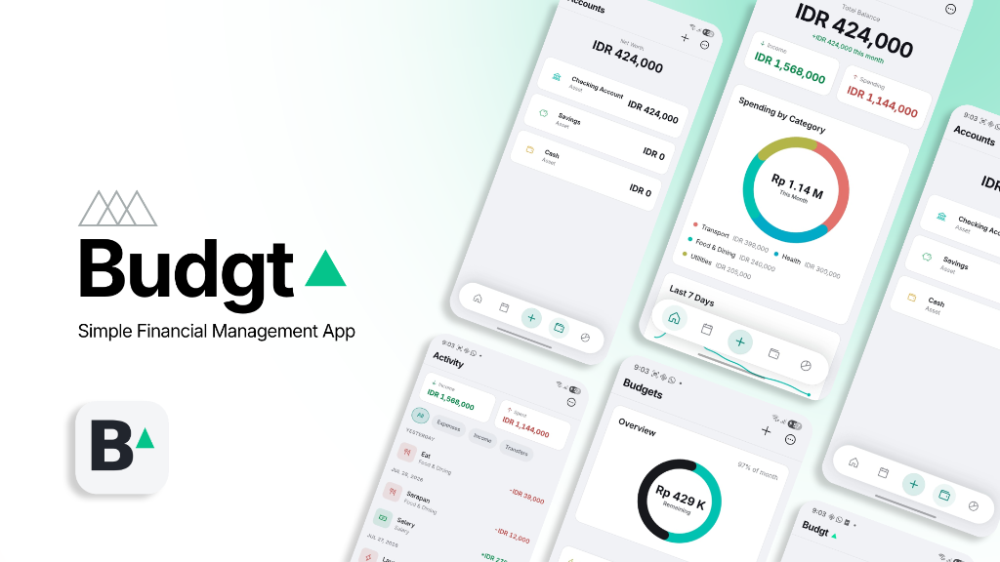

# 📱 BUDGT Mobile — Android App



**BUDGT Mobile** is the native Android application for the **BUDGT** personal finance tracker. Built with a lightweight Kotlin WebView shell packaging the local web engine, it offers an offline-first, native-feel experience on Android devices.

---

## 📲 Download & Installation

* 🤖 **Direct APK Download**: [`Budgt.apk`](Budgt.apk) *(Version 1.0.6, versionCode 7)*

---

## ✨ Features

* **📈 Real-Time Financial Dashboard**
  * Instant net worth overview and monthly cash flow (income vs. expense) summary.
  * Interactive category spending distribution charts and monthly trend visualizations.
  * Quick transaction feed for fast daily logging.

* **💸 Multi-Account Management & Ledger**
  * Support for both **Asset accounts** (Bank, Cash, Savings) and **Liability accounts** (Credit Cards, Loans).
  * Comprehensive transaction logging supporting **Withdrawals**, **Deposits**, and **Account Transfers**.
  * Dynamic auto-reconciliation: balances recalculate automatically whenever transactions are logged or edited.

* **🎯 Budgeting & Savings Goals (Piggy Banks)**
  * **Category Spending Limits:** Set monthly budget caps per category with visual progress indicators and threshold warnings.
  * **Piggy Banks:** Dedicated savings goal tracker to monitor milestone progress towards specific financial targets.

* **📅 Scheduled Bills & Subscriptions**
  * Recurring bill tracker to monitor upcoming due dates and recurring expenses.

* **📄 Financial Reports & Data Export**
  * **PDF Statement Generator:** In-browser export of detailed Profit & Loss (P&L) financial reports.
  * **Excel / CSV Data Dumps:** Export raw transaction ledgers for external analysis.
  * **JSON Backup & Restore:** Complete data backup and restore capabilities.

* **🌐 Multi-Currency & Localization**
  * Custom currency symbols (`USD`, `IDR`, `MYR`, `EUR`, `GBP`, `JPY`, etc.) and regional number formatting (`$1M`, `Rp 1 Jt`).
  * Multi-language support: English, Indonesian, and Malay.

* **🔒 100% Offline & Private**
  * Stores all financial records locally on-device. Zero external server analytics or tracking.

---

## 🛠️ Building From Source

To build the APK locally using Android Studio / Gradle:

```bash
cd Budgt-mobile
set JAVA_HOME=C:\Program Files\Android\Android Studio\jbr
.\gradlew.bat assembleDebug
```

The compiled APK will be generated at:
`app/build/outputs/apk/debug/app-debug.apk`
